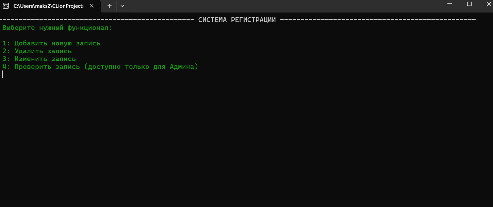
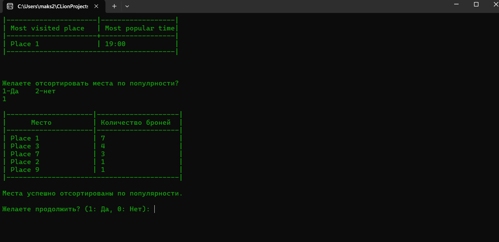

<b>Учебная практика по ОАИП на языке C   

В коде реализована запись пользователя, удаление, изменение,проверка мест через стэк, алгоритм хэширования sha256 для валидации супер пользователей, quickSort для генерации отчёта и др.Моменты
  
Главное меню:
   
Просмотр отчёта:
   
Получение данных после входа пользователя:

В репозитории также добавлены блочки для 6 алгосов, и отчёт по практике
